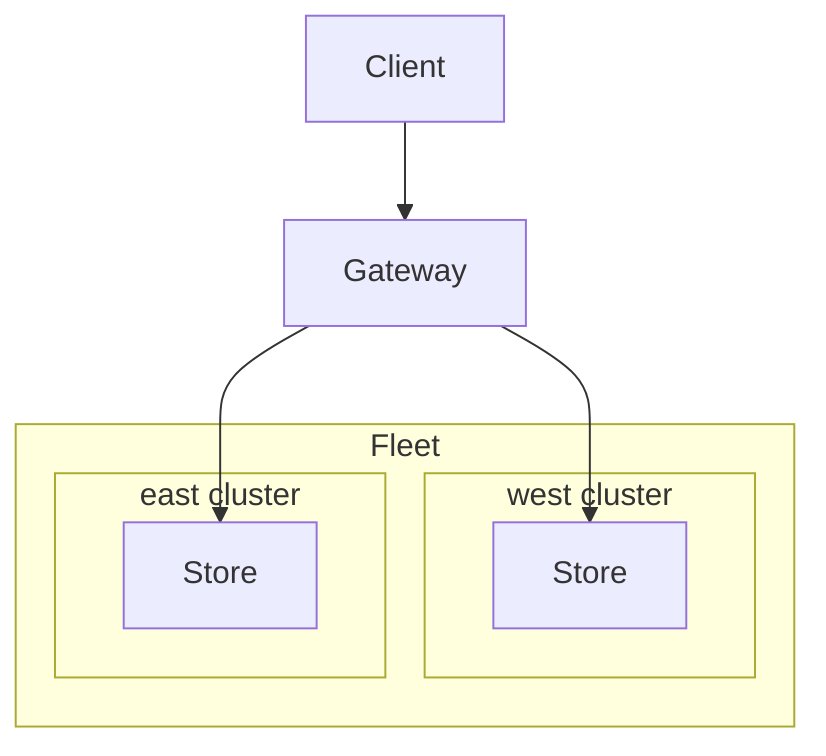

本職の Site Reliability Engineering について。

Multi-cluster Gateway が GA になったので、検証する。

https://cloud.google.com/blog/products/containers-kubernetes/multi-cluster-gateway-controller-for-gke-is-now-ga/?hl=en

これで、今まで `Ingress` で我慢していた cluster を `Gateway` に移行できる。

正確には「できないもの」もある。

なぜなら、複数 Project の Cluster には、まだ対応していないためです。認識に誤りがなければ。[^1]

とは言え、現職では、基本的には、単一 Project であるため、問題ない。

Gateway の動きを確認する。

## Create Multi-cluster Gateway
公式の docs[^3][^4] で問題なく setup できた。
気をつけるのは、Multi-region であること。Single region Multi-cluster ではない。

簡単に図にすると、こう言う感じ。
Fleet が出てくる時点で嫌な感じはします。個人的に。



https://github.com/danny-yamamoto/terraform-multi-cluster-gateways/blob/main/example/README.md

## Distribute traffic
traffic 分散がどうなるのか確認する。

`k6`[^2] で検証する。

準備は次の通り。
1. VS Code の extension を入れる。
1. script を準備する。
1. k6 を実行する。

### VS Code extension

https://github.com/danny-yamamoto/terraform-multi-cluster-gateways/blob/6aa42a310cc6193f08f55e583917072a5a49b550/.devcontainer/devcontainer.json#L10

### Script
```js
import http from 'k6/http';
import { sleep } from 'k6';

export default function () {
  http.get('http://store.example.com');
  sleep(1);
}
```

### Execute k6
```bash
vscode ➜ /workspaces/terraform-multi-cluster-gateways (main) $ k6 run --vus 30 --duration 60s test.js 

          /\      |‾‾| /‾‾/   /‾‾/   
     /\  /  \     |  |/  /   /  /    
    /  \/    \    |     (   /   ‾‾\  
   /          \   |  |\  \ |  (‾)  | 
  / __________ \  |__| \__\ \_____/ .io

  execution: local
     script: test.js
     output: -

  scenarios: (100.00%) 1 scenario, 30 max VUs, 1m30s max duration (incl. graceful stop):
           * default: 30 looping VUs for 1m0s (gracefulStop: 30s)


     data_received..................: 849 kB 14 kB/s
     data_sent......................: 129 kB 2.1 kB/s
     http_req_blocked...............: avg=725.74µs min=709ns    med=5.89µs   max=38.68ms  p(90)=15.41µs  p(95)=24.4µs  
     http_req_connecting............: avg=605.88µs min=0s       med=0s       max=32.63ms  p(90)=0s       p(95)=0s      
     http_req_duration..............: avg=152.26ms min=112.94ms med=128.9ms  max=500.83ms p(90)=209.28ms p(95)=245.09ms
       { expected_response:true }...: avg=152.26ms min=112.94ms med=128.9ms  max=500.83ms p(90)=209.28ms p(95)=245.09ms
     http_req_failed................: 0.00%  ✓ 0         ✗ 1572
     http_req_receiving.............: avg=622.21µs min=6.45µs   med=106.81µs max=114.73ms p(90)=1.25ms   p(95)=1.83ms  
     http_req_sending...............: avg=46.68µs  min=2.58µs   med=22.43µs  max=4.61ms   p(90)=76.31µs  p(95)=146.04µs
     http_req_tls_handshaking.......: avg=0s       min=0s       med=0s       max=0s       p(90)=0s       p(95)=0s      
     http_req_waiting...............: avg=151.59ms min=112.6ms  med=127.89ms max=500.43ms p(90)=208.39ms p(95)=244.85ms
     http_reqs......................: 1572   25.721444/s
     iteration_duration.............: avg=1.15s    min=1.11s    med=1.13s    max=1.53s    p(90)=1.21s    p(95)=1.24s   
     iterations.....................: 1572   25.721444/s
     vus............................: 2      min=2       max=30
     vus_max........................: 30     min=30      max=30


running (1m01.1s), 00/30 VUs, 1572 complete and 0 interrupted iterations
default ✓ [======================================] 30 VUs  1m0s
vscode ➜ /workspaces/terraform-multi-cluster-gateways (main) $ 
```

### Result Confirmation
Log Analytics で container の log をカウントする。

```sql
SELECT
  JSON_VALUE(resource.labels.location) AS cluster_location,
  COUNT(*) AS cnt
FROM
  `sandbox-mc-gateway.global._Default._AllLogs`
WHERE
  resource.type="k8s_container"
  AND timestamp >= TIMESTAMP("2023-11-30 13:03:00", "Asia/Tokyo")
  AND timestamp <= TIMESTAMP("2023-11-30 13:06:00", "Asia/Tokyo")
GROUP BY
  cluster_location
```

west 側に寄ってますが、一応、振り分けられていることが確認できる。
```bash
[
  {
    "id": "ROW_fcde01ba_0000000000",
    "cluster_location": "us-west1-a",
    "cnt": 15369
  },
  {
    "id": "ROW_fcde01ba_0000000001",
    "cluster_location": "us-east1-b",
    "cnt": 583
  }
]
```

Terraform で code 化しようと思いましたが、正月の暇な時にやります。

[^1]: https://cloud.google.com/kubernetes-engine/docs/how-to/enabling-multi-cluster-gateways#restrictions_and_limitations
[^2]: https://k6.io/docs/
[^3]: https://cloud.google.com/kubernetes-engine/docs/how-to/deploying-multi-cluster-gateways
[^4]: https://cloud.google.com/kubernetes-engine/docs/how-to/enabling-multi-cluster-gateways
