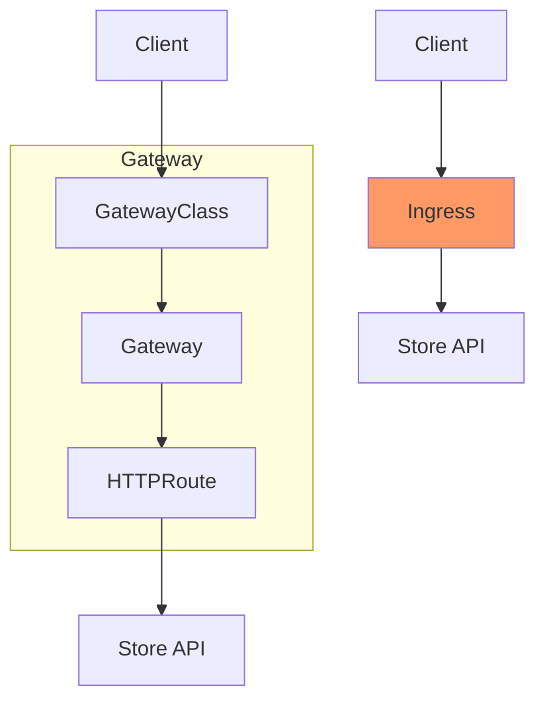
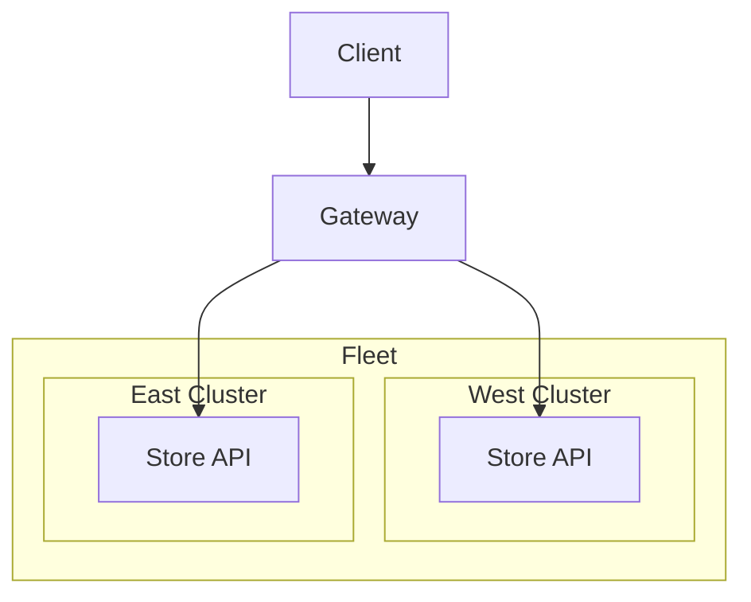

[Retail AI Adventurers Advent Calendar 2023 の投稿です。](https://qiita.com/advent-calendar/2023/rai-adventurers)

https://qiita.com/advent-calendar/2023/rai-adventurers

[Retail AI](https://www.retail-ai.jp) は、[トライアルカンパニー](https://www.trial-net.co.jp) を軸とした小売におけるお客様の買い物体験の向上を目指す企業です。

この投稿では、私の本職の Site Reliability Engineering[^8] について書きます。

題材は、Multi-cluster Gateway（Gateway）です。最近、GA[^7] になったので、検証します。

https://gateway-api.sigs.k8s.io

https://cloud.google.com/blog/products/containers-kubernetes/multi-cluster-gateway-controller-for-gke-is-now-ga/?hl=en

Gateway を簡単に説明すると「新製品が出て、これまでより便利になった」という感じの機能です。

（Mac を update すると追加される機能のような。気にしない人にとってはあっても無くても変わらないような。）


さらに詳しく見たい方は読み続けてください。

---

Gateway について、もう少し詳しく説明すると、External Application Load Balancer `Ingress` で我慢していた Ops を改善することができます。

https://cloud.google.com/kubernetes-engine/docs/concepts/ingress?hl=ja

右：新製品発売前
左：新製品発売後

`Ingress` が3つの役割に分かれていることがわかります。

こうなることで、役割分担を行えます。Developer / Infrastructure Engineer / SRE の。

それが一番嬉しいポイントです。地味に。



それでは、Multi-cluster Gateway の動きを確認します。

## Create a Multi-cluster Gateway and Cluster
公式の docs[^3][^4] で問題なく setup できます。
気をつけるのは、`Multi` Region[^6] であることです。`Single` Region Multi-cluster ではありません。

簡単に図にすると、こう言う感じです。
`Fleet`[^5] が出てくる時点で嫌な感じはします。個人的に。



https://github.com/danny-yamamoto/terraform-multi-cluster-gateways/blob/main/example/README.md

## Distribute traffic
traffic 分散がどうなるのか確認します。

検証に用いるのは `k6`[^2] です。

準備は次の通り。
1. VS Code に k6 の extension を追加する。
1. script を準備する。
1. k6 を実行する。

### Add a VS Code extension

https://github.com/danny-yamamoto/terraform-multi-cluster-gateways/blob/6aa42a310cc6193f08f55e583917072a5a49b550/.devcontainer/devcontainer.json#L10

### Create a script
`Store` API の Endpoint `http://store.example.com` に対して負荷をかけます。
```js: test.js
import http from 'k6/http';
import { sleep } from 'k6';

export default function () {
  http.get('http://store.example.com');
  sleep(1);
}
```

### Execute k6
`Store` API の単一の Endpoint に以下の条件で traffic を流します。
- `--vus` : 並列実行数 30
- `--duration` : 60秒間
```bash
vscode ➜ /workspaces/terraform-multi-cluster-gateways (main) $ k6 run --vus 30 --duration 60s test.js 

          /\      |‾‾| /‾‾/   /‾‾/   
     /\  /  \     |  |/  /   /  /    
    /  \/    \    |     (   /   ‾‾\  
   /          \   |  |\  \ |  (‾)  | 
  / __________ \  |__| \__\ \_____/ .io

  execution: local
     script: test.js
     output: -

  scenarios: (100.00%) 1 scenario, 30 max VUs, 1m30s max duration (incl. graceful stop):
           * default: 30 looping VUs for 1m0s (gracefulStop: 30s)


     data_received..................: 849 kB 14 kB/s
     data_sent......................: 129 kB 2.1 kB/s
     http_req_blocked...............: avg=725.74µs min=709ns    med=5.89µs   max=38.68ms  p(90)=15.41µs  p(95)=24.4µs  
     http_req_connecting............: avg=605.88µs min=0s       med=0s       max=32.63ms  p(90)=0s       p(95)=0s      
     http_req_duration..............: avg=152.26ms min=112.94ms med=128.9ms  max=500.83ms p(90)=209.28ms p(95)=245.09ms
       { expected_response:true }...: avg=152.26ms min=112.94ms med=128.9ms  max=500.83ms p(90)=209.28ms p(95)=245.09ms
     http_req_failed................: 0.00%  ✓ 0         ✗ 1572
     http_req_receiving.............: avg=622.21µs min=6.45µs   med=106.81µs max=114.73ms p(90)=1.25ms   p(95)=1.83ms  
     http_req_sending...............: avg=46.68µs  min=2.58µs   med=22.43µs  max=4.61ms   p(90)=76.31µs  p(95)=146.04µs
     http_req_tls_handshaking.......: avg=0s       min=0s       med=0s       max=0s       p(90)=0s       p(95)=0s      
     http_req_waiting...............: avg=151.59ms min=112.6ms  med=127.89ms max=500.43ms p(90)=208.39ms p(95)=244.85ms
     http_reqs......................: 1572   25.721444/s
     iteration_duration.............: avg=1.15s    min=1.11s    med=1.13s    max=1.53s    p(90)=1.21s    p(95)=1.24s   
     iterations.....................: 1572   25.721444/s
     vus............................: 2      min=2       max=30
     vus_max........................: 30     min=30      max=30


running (1m01.1s), 00/30 VUs, 1572 complete and 0 interrupted iterations
default ✓ [======================================] 30 VUs  1m0s
vscode ➜ /workspaces/terraform-multi-cluster-gateways (main) $ 
```

### Result Confirmation
Cloud Monitoring の Log Analytics[^11] で container の log をカウントしてみます。

```sql
SELECT
  JSON_VALUE(resource.labels.location) AS cluster_location,
  COUNT(*) AS cnt
FROM
  `sandbox-mc-gateway.global._Default._AllLogs`
WHERE
  resource.type="k8s_container"
  AND timestamp >= TIMESTAMP("2023-11-30 13:03:00", "Asia/Tokyo")
  AND timestamp <= TIMESTAMP("2023-11-30 13:06:00", "Asia/Tokyo")
GROUP BY
  cluster_location
```

以下が実行結果です。
一応、振り分けられていることが確認できます。west 側に寄ってますが。
```bash
[
  {
    "id": "ROW_fcde01ba_0000000000",
    "cluster_location": "us-west1-a",
    "cnt": 15369
  },
  {
    "id": "ROW_fcde01ba_0000000001",
    "cluster_location": "us-east1-b",
    "cnt": 583
  }
]
```

Terraform[^9] で code 化しようと思いましたが、正月の暇な時にやります。

今の気分は Rust[^10] に全振りのため。

Gateway に関する検証は以上です。

この投稿をみて何か得られた方は、いいね ❤️ をお願いします。

それでは、次回のアドカレでお会いしましょう。👋

明日は、 [@Carol_fan](https://qiita.com/Carol_fan) さんの投稿です。お楽しみに！

## BTW
Multi-cluster Gateway で「できないこと」もあるようです。

例えば、複数 Project の Cluster には、まだ対応していないです。認識に誤りがなければ。[^1]

とは言え、現職では、基本的には、単一 Project であるため、問題ありません。


[^1]: https://cloud.google.com/kubernetes-engine/docs/how-to/enabling-multi-cluster-gateways#restrictions_and_limitations
[^2]: https://k6.io/docs/
[^3]: https://cloud.google.com/kubernetes-engine/docs/how-to/deploying-multi-cluster-gateways
[^4]: https://cloud.google.com/kubernetes-engine/docs/how-to/enabling-multi-cluster-gateways
[^5]: Fleet は、複数の Kubernetes クラスターを一元的に管理し、操作するためのフレームワークです。
[^6]: Region は、Google Cloud の Resource と Service が物理的に配置されている地理的な場所を指します。東京、大阪など。
[^7]: 一般提供。
[^8]: Site Reliability Engineering（SRE）は、ソフトウェアエンジニアリングの原則とプラクティスをシステム運用に適用することにより、大規模なシステムの信頼性、可用性、パフォーマンス、効率性を向上させるアプローチです。
[^9]: Terraformは、HashiCorpによって開発されたオープンソースのインフラストラクチャー・アズ・コード（Infrastructure as Code、IaC）ツールです。このツールは、クラウドサービス（AWS、Google Cloud Platform、Microsoft Azureなど）、オンプレミスリソース、およびその他多くの外部サービスやAPIを含む、広範なインフラストラクチャーの設定と管理を自動化するために広く使用されています。
[^10]: Rust は、パフォーマンス、安全性、並行処理に重点を置いたシステムプログラミング言語です。
[^11]: Log Analytics は、Google Cloud 上のログデータを収集、分析、可視化するためのサービスです。ユーザーはカスタムクエリを使用して、特定のログデータを深く掘り下げることができます。
